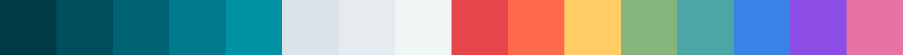
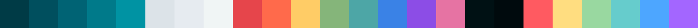

<h3 align="center">
	 
	Deep Oceanic Next Color Theme
</h3>

	
	

	
	

---

### 참고할 테마, 컬러 스킴들
- [gruvbox](https://github.com/morhetz/gruvbox)
- [solarized](https://github.com/altercation/solarized) -> [web](https://ethanschoonover.com/solarized/)
- [iterm2-material-design](https://github.com/MartinSeeler/iterm2-material-design) -> [web](https://www.iterm2material.design/?utm_source=GitHub&utm_medium=social&utm_campaign=sidebar)
- [material-theme](https://material-theme.com/)

### 내가 만든 색상
16색상 

24색상

로고

작업한 결과물
- [intellij](https://plugins.jetbrains.com/plugin/25272-deep-oceanic-next-theme?noRedirect=true)

---

https://www.iterm2material.design/?utm_source=GitHub&utm_medium=social&utm_campaign=sidebar
위의 같은 페이지를 하나 만들고 싶다.