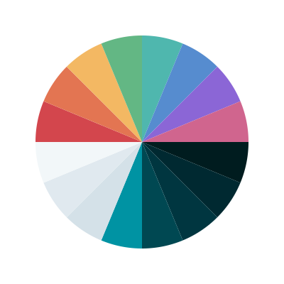

# Deep Oceanic Next
It’s a place where light bends and dances, where the colors shift and deepen in ways you can only imagine. For most of us, the deep ocean is a mystery—vast, quiet, and endlessly captivating. It’s a place we rarely touch, yet it feels like it touches us.

For years, I’ve been both fascinated and terrified by the ocean. I can’t swim—not even in water as shallow as my height. The fear of being swept away, of sinking, is real. But so is the wonder. The deep ocean, to me, is like a dream: unattainable yet vivid in my imagination.

The Deep Oceanic Next color theme was born from this paradox. It’s a palette inspired by the gradients of the ocean’s depths—from the near-black shadows to the glimmers of light that pierce through. It reflects the courage to embrace what we don’t understand and the beauty that lies in exploring the unknown.

This theme isn’t just about colors; it’s about a journey. A reminder that even if we can’t dive into the deep blue ourselves, we can bring a piece of it into our world—into our screens, our workspaces, and our creative expressions.

So, have you ever wondered what it’s like to dive into the unknown? To explore the depths that so few have seen? Maybe, together with this theme, you can take that step into your own deep ocean?

---

# Deep Oceanic Next Theme - Full Palette

  

## Background and Foreground Colors

| Color Box                                                                                                     | Name | Hex Code | Description |
|---------------------------------------------------------------------------------------------------------------|------|----------|-------------|
|  | Base00 | `#001c1f` | Primary Background |
|  | Base01 | `#002931` | Secondary Background |
|  | Base02 | `#003640` | Tertiary Background |
|  | Base03 | `#004852` | Low Contrast Text Background |
|  | Base04 | `#0093a3` | Dark Foreground |
|  | Base05 | `#d4e1e8` | Foreground |
|  | Base06 | `#e0e9ef` | High Foreground |
|  | Base07 | `#f2f7f9` | Bright Foreground |

## Syntax Highlighting Colors

| Color Box                                                                                                     | Name | Hex Code | Description |
|---------------------------------------------------------------------------------------------------------------|------|----------|-------------|
|  | Base08 | `#d3464d` | Warm Red - Variables, Errors |
|  | Base09 | `#e37552` | Warm Orange - Constants |
|  | Base0A | `#f3b863` | Muted Gold - Classes, Functions |
|  | Base0B | `#63b784` | Fresh Green - Strings |
|  | Base0C | `#4fb7ae` | Aqua Cyan - Support, Regex |
|  | Base0D | `#568ccf` | Oceanic Blue - Keywords |
|  | Base0E | `#8b66d6` | Vibrant Purple - Markup |
|  | Base0F | `#d0658e` | Warm Pink - Deprecated |

## Additional Colors

| Color Box                                                                                                     | Name | Hex Code | Description |
|---------------------------------------------------------------------------------------------------------------|------|----------|-------------|
|  | Base10 | `#1f2628` | Darker Black for Highlights |
|  | Base11 | `#2a2f30` | Darkest Black for Shadows |
|  | Base12 | `#ff6670` | Bright Red - Warnings |
|  | Base13 | `#ffe08a` | Bright Yellow - Highlights |
|  | Base14 | `#72e1a6` | Bright Green - Success Indicators |
|  | Base15 | `#4de3e3` | Bright Cyan - Links |
|  | Base16 | `#5caeff` | Bright Blue - Active States |
|  | Base17 | `#b788ff` | Bright Purple - Accents |

---

# Themes
- [iTerm2](https://raw.githubusercontent.com/spearkkk/deep-oceanic-next/master/themes/deep-oceanic-next.itermcolors)
- [starship](https://github.com/spearkkk/deep-oceanic-next-starship)
- [IntelliJ IDEA](https://plugins.jetbrains.com/plugin/25272-deep-oceanic-next-theme?noRedirect=true)
- [Chrome Theme](https://chromewebstore.google.com/detail/deep-oceanic-next-chrome/embaoimilojjfdbjancmkfdmiegfbhdm)
- [Alfred Theme](https://www.alfredapp.com/extras/theme/jM31MRnWNH/)